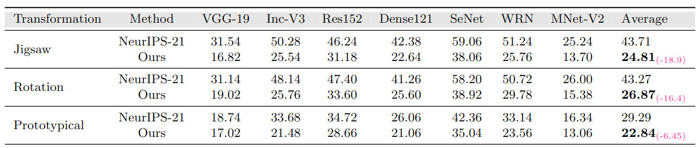
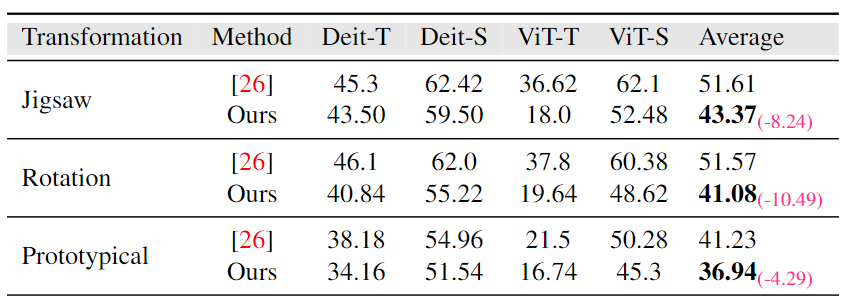

### **Adversarial Pixel Restoration as a Pretext Task for Transferable Perturbations**

[Hashmat Shadab Malik](https://scholar.google.com/citations?user=2Ft7r4AAAAAJ&hl=en), 
[Shahina Kunhimon](https://github.com/ShahinaKK),
[Muzammal Naseer](https://scholar.google.ch/citations?user=tM9xKA8AAAAJ&hl=en),
[Salman Khan](https://salman-h-khan.github.io),
and [Fahad Shahbaz Khan](https://scholar.google.es/citations?user=zvaeYnUAAAAJ&hl=en)

[]()

#

> **Abstract:** *Transferable adversarial attacks optimize adversaries from a pretrained surrogate model and known label space to fool the unknown black-box models. Therefore, these attacks are restricted by the availability of an effective surrogate model. In this work, we relax this assumption and propose Adversarial Pixel Restoration as a self-supervised alternative to train an effective surrogate model from scratch  under the condition of no labels and few data samples. Our training approach is based on min-max objective which reduces overfitting via an adversarial objective and thus optimizes for a more generalizable surrogate model. Our proposed attack is complimentary to our adversarial pixel restoration and is independent of any task specific objective as it can be launched in a self-supervised manner.  We successfully demonstrate the adversarial transferability of our approach to Vision Transformers as well as Convolutional Neural Networks for the tasks of classification, object detection and video segmentation.* 


The equations in the above algorithm are mentioned in the paper.

## Comparison with the Baseline Method [Practical No-box Adversarial Attacks (NeurIPS-2021)](https://arxiv.org/abs/2012.02525)
1. Transferability on Convolutional Networks.


2. Transferability on Vision Transformers.


<hr />


## Dataset Preparation
Download the [ImageNet-Val](http://image-net.org/) classification dataset and structure the data as follows:
```
└───data
    ├── selected_data.csv
    └── ILSVRC2012_img_val
        ├── n01440764
        ├── n01443537
        └── ...
    
```
Cross-Domain Datasets:
  * [Paintings](https://www.kaggle.com/c/painter-by-numbers)
  * [Comics](https://www.kaggle.com/cenkbircanoglu/comic-books-classification)
  * [CoCo-2017(41k)](https://cocodataset.org/#download)

Directory structure should look like this:
 ```
    |paintings
        |images
                img1
                img2
                ...
```

<hr />

## Installation
1. Create conda environment
```shell
conda create -n apr
```
2. Install PyTorch and torchvision
```shell
conda install pytorch torchvision torchaudio cudatoolkit=11.3 -c pytorch
```
3. Install other dependencies
```shell
pip install -r requirements.txt
```

<hr />


<hr />

## Usage

Run the following command to train multiple autoencoders on in-domain samples using our method.

```shell
python train.py --mode rotate --adv_train True --fgsm_step 2 \
--n_iters 2000 --save_dir ./trained_models
```
For mounting the untargetted attack on the in-domain ImageNetVal samples using the trained autoencoders, run:
```shell
python attack.py --epsilon 0.1 --ila_niters 100 --ce_niters 200 \
--ce_epsilon 0.1 --ce_alpha 1.0 --n_imgs 20 --ae_dir ./trained_models \
--mode rotate  --save_dir /path/to/save/adv_images
```
mode can be set as `rotate/jigsaw/prototypical`. Top-1 accuracy on several classification models is evaluated after crafting adversarial examples, results 
are saved in a csv file within the adversarial image folder.

Run the following command to train a single autoencoders on cross-domain samples(Paintings, CoCo, Comics) using our method.

```shell
python train_single.py  --mode rotate --adv_train True --fgsm_step 2 \
--end_epoch 50 --data_dir paintings/ --save_dir ./single_trained_models
```
mode can be set as `rotate/jigsaw`

For mounting the untargetted attack on the ImageNetVal using the trained autoencoder, run:
```shell
python attack_single.py --epsilon 0.1 --ila_niters 100 --ce_niters 200 \
--ce_epsilon 0.1 --ce_alpha 1.0 --n_imgs 20 --chk_pth path/to/trained/model/ 
--save_dir /path/to/save/adv_images
```


<hr />

## Citation
If you use our work, please consider citing:
```bibtex
   
```

<hr />

## Contact
Should you have any question, please create an issue on this repository or contact at hashmat.malik@mbzuai.ac.ae

<hr />

## References
Our code is based on [ Practical No-box Adversarial Attacks against DNNs](https://github.com/qizhangli/nobox-attacks) repository. 
We thank them for releasing their code.
