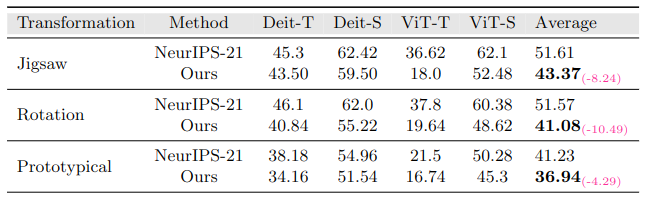

### **Adversarial Pixel Restoration as a Pretext Task for Transferable Perturbations**

[Hashmat Shadab Malik](https://scholar.google.com/citations?user=2Ft7r4AAAAAJ&hl=en), 
[Shahina Kunhimon](),
[Muzammal Naseer](https://scholar.google.ch/citations?user=tM9xKA8AAAAJ&hl=en),
[Salman Khan](https://salman-h-khan.github.io),
and [Fahad Shahbaz Khan](https://scholar.google.es/citations?user=zvaeYnUAAAAJ&hl=en)

[]()

##  🚀  News
* **(July ##, 2022)**
  * Training and evaluation code along with pre-trained models are released.
  
<hr />


> **Abstract:** *Transferable adversarial attacks optimize adversaries from a pretrained surrogate model and known label space to fool the unknown black-box models. Therefore, these attacks are restricted by the availability of an effective surrogate model. In this work, we relax this assumption and propose Adversarial Pixel Restoration as a self-supervised alternative to train an effective surrogate model from scratch  under the condition of no labels and few data samples. Our training approach is based on min-max objective which reduces overfitting via an adversarial objective and thus optimizes for a more generalizable surrogate model. Our proposed attack is complimentary to our adversarial pixel restoration and is independent of any task specific objective as it can be launched in a self-supervised manner.  We successfully demonstrate the adversarial transferability of our approach to Vision Transformers as well as Convolutional Neural Networks for the tasks of classification, object detection and video segmentation.* 
<hr />


## Comparison with the Baseline Method [Practical No-box Adversarial Attacks (NeurIPS-2021)](https://arxiv.org/abs/2012.02525)
1. Transferability on Convolutional Networks.


2. Transferability on Vision Transformers.


<hr />

## Grad-CAM Visualization


## Installation
1. Create conda environment
```shell

```
2. Install PyTorch and torchvision
```shell
```
3. Install other dependencies
```shell
pip install -r requirements.txt
```

<hr />

## Dataset Preparation
Download the [ImageNet-Val](http://image-net.org/) classification dataset and structure the data as follows:
```
└───data
    ├── selected_data.csv
    └── ILSVRC2012_img_val
        ├── n01440764
        ├── n01443537
        └── ...
    
```

<hr />

## Evaluation
Download the pretrained weights and run the following command for evaluation on ImageNet-1K dataset.

```shell
```
This should give,
```text
```


<hr />

## Training

Run the following command to train autoencoders on in-domain samples.

```shell
python train.py
```
<hr />

## Citation
If you use our work, please consider citing:
```bibtex
   
```

<hr />

## Contact
Should you have any question, please create an issue on this repository or contact at hashmat.malik@mbzuai.ac.ae

<hr />

## References
Our code is based on [ Practical No-box Adversarial Attacks against DNNs](https://github.com/qizhangli/nobox-attacks) repository. 
We thank them for releasing their code.